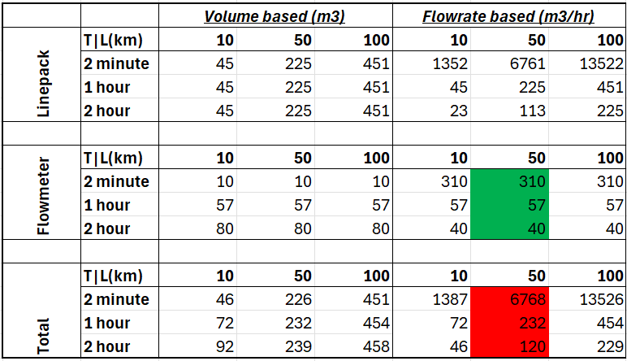
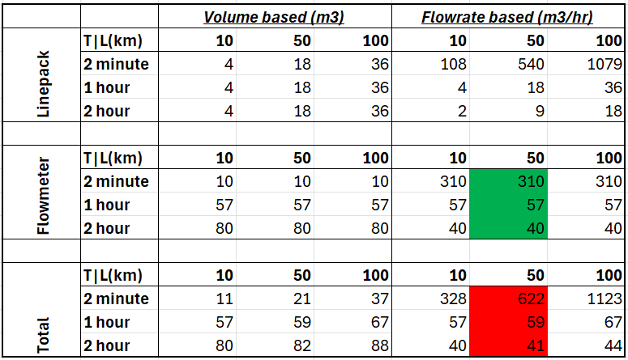

# Leak Detection Method

## Overview

The mass balance method, rooted in conservation of mass, is the primary leak detection approach for South Bow's liquid pipeline systems. In a leak-free system, the inlet mass flow rate ($\dot{m}_{{in}}$) minus the outlet mass flow rate ($\dot{m}_{{out}}$) equals the rate of change of linepack mass ($\frac{dM}{dt}$) in a time-averaged sense over a sufficient period. This method is effective for two reasons:

1. Physics of Incompressibility: Crude oil’s near-incompressibility has two implications:
    - The linepack mass change in a leak-free system is small compared to the total pipeline inventory (see Example 1). This emphasizes accurate measurement of inlet and outlet mass flow rates over precise linepack estimation, which is challenging for long transmission pipelines with sparse measurements of state variables (pressure, density, flow rate, temperature) along the pipeline.

    - The timescale for state transitions, i.e., from one steady state to another or in a quasi-steady sense, is approximately 100 $ {s} $ (see Example 2). A 5-minute averaging window thus smooths rapid transients, simplifying state estimation from a nonlinear problem to a quasi-steady or steady-state problem, though slow transients may persist and requires further attention.

2. Robust Instrumentation: South Bow's liquid pipeline system is well-instrumented. All pipeline segments bounded by receipt, delivery, and pump stations are equipped with high-precision flow meters, with uncertainty estimated to be at the order of 1% of nominal flowrate. Additionally, pressure transducers and densitometers along the way further track product movement and account for inventory variations, which add an extra layer of sensitivity to the mass balance approach. All flow, pressure, and density measurements are transmitted via the SCADA network and can be fed into the leak detection system at a 5-second interval, providing sufficient temporal resolution for non-leak related variations (e.g., thermal expansion, pump transients), which will be explained further in the next section.

## The mass balance method

The mass balance method can be obtained by directly integrating the conservation of mass over the entire pipe volume:

$$\rho(0, t)Q(0, t) - \rho(L, t)Q(L, t) = \frac{d}{dt} \int_0^L \rho(x,t) A(x) \mathrm{d}x$$

The left-hand side represents the inlet and outlet mass flow rates, which are measured by densitometers and flow meters at pipe conditions ($P$, $T$). Flow meters typically report standard volume flow rate ($Q_s$), by converting actual flow rate $Q$ to a standard condition ($P_s$, $T_s$). The actual mass flow rate $\dot{m}$ can be recovered from measurements with $\dot{m} = \rho Q_s \frac{P_s}{P} \frac{T}{T_s}$, or simply $\dot{m} = \rho_s Q_s$ if the density at standard conditions ($\rho_s $) is reported instead. Using the equation of state $K = \rho \frac{dP}{d\rho}$, the above expression can be converted to:

$$\dot{m}_{{in}} - \dot{m}_{{out}} = \frac{d}{dt} \int_0^L \frac{\rho A}{K} P \mathrm{d}x$$

This expression is the starting point of the mass balance method. The left-hand side can be obtained from direct flow rate and density measurements, and the right-hand side involves estimation of the linepack mass rate-of-change, which commonly requires a combination of measurement and model, known as state estimation in control theory.

To lessen the influence of stochastic errors in measurements, such as those arising from random jitters from electronics, turbulence along the main flow stream, or random perturbations in the pipe boundary from control devices, as well as the requirement for state estimation of the rate-of-change of state variables, time averaging is typically used, and the above expression can be simplified to:

$$m_{{in}, \Delta t} - m_{{out}, \Delta t} = \left. \int_0^L \frac{\rho A}{K} P \mathrm{d}x\right|_{t+\Delta t} - \left. \int_0^L \frac{\rho A}{K} P \mathrm{d}x\right|_t$$

Here, the $m_{{in}, \Delta t}$ and  $m_{{out}, \Delta t}$ represent cumulative mass over $/\Delta t$, omitting the $\Delta t$ term.  

## Uncertainty analysis - baseline

With the final expression of the mass balance method above, uncertainty analysis can be used to establish the baseline variance, which is closely related to leak detection threshold. Assuming the uncertainty associated with the flowrate measurement and the linepack estimation is Gaussian distributed, the variance can be estimated as:

$$
\sigma_f^2 \approx \sum_i \partial_{x_i}f(x_i) \sigma_i^2
$$

Where 

$$
f = m_{{in}, \Delta t} - m_{{out}, \Delta t} - \left. \int_0^L \frac{\rho A}{K} P \mathrm{d}x\right|_{t+\Delta t} + \left. \int_0^L \frac{\rho A}{K} P \mathrm{d}x\right|_t
$$

Modify the above equation to express in the independent variables in which the measurement of variance is available:

$$
f = T (\sum_{i=1}^N \dot{m}_{in,i} + \sum_{i=1}^N \dot{m}_{out,i}) + \left.M\right|_{t+\Delta t} - \left.M\right|_{t}
$$
 
where $T$ is the sampling rate of the flowrate measurement. With the variance for each individual variables:

- Inlet flowrate ($\dot{m}_{in,i}$): $\sigma_{in,i}^2$ ($\sigma_{in,i}$ is the flow meter error).
- Outlet flowrate ($\dot{m}_{out,i}$): $\sigma_{out,i}^2$ ($\sigma_{in,i}$ is the flow meter error).
- Linepack ($M$): $[\rho_o V(\exp\left(\frac{\Delta P}{K_o}\right) - 1)]^2$ (see Example 1).

Hence

$$
\sigma_f^2 = \Delta t N (\sigma_{in,i}^2 + \sigma_{out,i}^2) + 2[\rho_o V(\exp\left(\frac{\Delta P}{K_o}\right) - 1)]^2
$$

where $N=T/\Delta t$ is the number of sampling points over the averaging window $T$. More commonly, the uncertainty is expressed in standard deviation ($\sigma_{f,M}$), which will then have the same unit as threshold, and sometimes converted to standard volume ($\sigma_{f,Q}$) or standard volume flowrate ($\sigma_{f,Q}'$):

$$\sigma_{f,M} = \sqrt{\Delta t N (\sigma_{in,i}^2 + \sigma_{out,i}^2) + 2[\rho_o V(\exp\left(\frac{\Delta P}{K_o}\right) - 1)]^2}$$
$$\sigma_{f,Q} = \sqrt {\Delta t N (\sigma_{in,i}^2 + \sigma_{out,i}^2)/\rho_o^2 + 2[V(\exp\left(\frac{\Delta P}{K_o}\right) - 1)]^2}$$
$$\sigma_{f,Q}' = \sigma_{f,Q} / T$$

The above expression can be used to estimate baseline threshold for a leak detection system without linepack estimation. I call this baseline because the threshold is only dependant of uncertainty of flow and density measurement and fluid compressibility, both can be quantified as pre-conditions to the detection system. For crude oil with bulk modulus pipe inner diameter $D=0.9[{m}]$, $K_o = 10^9 [{Pa}]$, density $\rho_o = 10^3 [{kg/m}^3]$, operating pressure range $\Delta P = 5e6 [{Pa}]$ and sampling rate $\Delta t=5[{s}]$, baseline threshold can be estimated using the above expressions for different pipe length $L=[10,50,100][{km}]$ and different averaging windows $T=[1/30, 1, 2][{hr}]$:

For a 50 ${km}$ long pipeline with the above properties, the final leak detection threshold is expected to be between what are highlighted in green and red. The green highlights the best case scenario, where linepack estimation is accounted for effectively and its contribution to final variance is at least an order of magnitude smaller than those from the flowrate measurements. The red highlights the worst case scenario, where there is no effective linepack estimation at all and its uncertainty due to fluid compressibility has to be accounted for in the threshold.

It is important to note that, owing to incompressibility, the mass-balance approach using only flow meters (accurate ones), can achieve quite sensitive detection (single digit percentage in pipe volume). To further improve the level of sensitivity, the system must improve on linepack estimation, as it accounts for majority of the total uncertainty for all averaging windows.

## State-estimation of linepack

It is evidence from the above section that even with precise flowrate measurements, the effectiveness of a mass-balance-based leak detection system depends on its ability to estimate the current state of line-pack. Let's explore some methods to improve the linepack estimation.

### Momentum-based approach

As it was alluded in the overview, the time-scale of state-transition is a key to a robust linepack state-estimation. Recall that the original set of Partial Differential Equations, namely the Conservation of Mass, Momentum and Energy, form a set of nonlinear hyperbolic partial differential equations, with characteristic wave speeds: $\lambda_1 = u$ and $\lambda_{2,3} = u \pm \sqrt{{K}/{\rho} + g H}$, where $\lambda_1$, is responsible primarily for advection of material and its associated thermodynamic properties, such as density, temperature, bulk modulus and etc, and it is at the order of velocity of pipe flow; while $\lambda_{2,3}$ is responsible for the pressure-velocity waves, which travels at close to the speed of sound. 

From a dynamical system point of view, i.e. if we think of the primitive variables $[P, u, T]$ of the conservation equation being the state vector of a dynamical system: the system are controlled to a set of stable states driven by control devices installed at both end of a pipeline segment; two types of disturbances can make $[P, u, T]$ deviate from the stable state:

1. Advection, associated with $\lambda_1$ and with a time scale of $L/\bar{u}$, where $\bar{u}$ is the average velocity across the pipeline segment. This type of disturbances is due to the change of product properties in the pipeline due to what is being supplied, delivered and heat transfer between the fluid and its environment.
2. Pressure-velocity waves, associated with $\lambda_{2,3}$ and with a time scale of $L/c$, where $c=\sqrt{K/\rho}$. This type of disturbances is due to rapid change of boundary conditions due to change in control setpoints or unintended disturbances. 

For a typical transmission pipeline segment (see Example 2), this means it takes less than one minute for any pressure-velocity wave associated with  $\lambda_{2,3}$ to propagate across the system and settle to another equilibrium state under which $\lambda_1$ dominates.

Thus, the conservation equation can be simplified, by applying a smoothing function to remove the pressure-velocity dynamics arisen from the disturbances, say with a time and space average kernel $\langle\cdot\rangle = \frac{1}{T}\int_{t-T}^{t} \int_{x=0}^L \cdot A\mathrm{d}x\mathrm{d}t$. Note that I applied the spacial integral over the whole pipe volume here instead of a spacial average owing to the fact that the characteristic length scale associated with the dynamics needed to be averaged out is typically smaller than the actual pipe segment length (Example 2, assuming the smallest T is 5 minutes). The conservation equations (see [fundamentals](./fundamental.md)) can be then simplified to:

- Mass: $\partial_t\langle\rho\rangle + \left.(\rho u)\right|_{x=L} - \left.(\rho u)\right|_{x=0}= 0$

This is simply the mass balance equation I showed before. However, it is important to note that $\partial_t\langle\rho\rangle \cdot T$ is exactly the linepack change over an averaging window ($T$) we are trying to estimate, i.e. $\left. \int_0^L \frac{\rho A}{K} P \mathrm{d}x\right|_{t+\Delta t} + \left. \int_0^L \frac{\rho A}{K} P \mathrm{d}x\right|_t$. This is an important point for the next step:

- Momentum: $\langle \rho\rangle\partial_t\langle u\rangle + \langle u\rangle\partial_t\langle\rho\rangle + \left.P\right|_{x=L} - \left.P\right|_{x=0} = \langle \rho\rangle g (\left.H\right|_{x=0} - \left.H\right|_{x=L}) - \frac{\langle f\rangle \langle \rho\rangle \langle u\rangle^2}{2D}$

The momentum equation is reduced to a Ordinary Differential Equation of $\langle \rho\rangle$, or simply an algebraic equation if the time-derivative are dropped due to their values being orders of magnitudes lower than the other terms in typical steady-state pipeline conditions. The friction factor could have relative large temperature dependence via fluid viscosity, and that's where the below:

- Energy: $\partial_t (\langle\rho\rangle c_v \langle T\rangle) + \left.(\langle u\rangle \langle\rho\rangle c_v \langle T\rangle)\right|_{x=L} - \left.(\langle u\rangle \langle\rho\rangle c_v \langle T\rangle)\right|_{x=0} = -h (\langle T\rangle-\langle T_{ref}\rangle)$

estimates the average temperature of the fluid in the pipe segment given the environment temperature $T_{ref}$ and an estimate of the average density $\langle\rho\rangle$, which can achieved by solving the averaged momentum and energy equations together, or using a property tracking model that solves the advection equations: $\partial_t q + \langle u\rangle \partial_x q$, where $q$ is any relevant fluid property, such as density, viscosity or bulk modulus.

State-estimation using the aforementioned model can be done by solving the averaged momentum equation, with pressure measurements at both end of a pipe segment being $\left.P\right|_{x=L}$ and $\left.P\right|_{x=0}$, flowrate measurement being $\langle u\rangle$, and the appropriate fluid properties, the equation can be solves exactly for the linepack change over the period $\Delta t$, $\partial_t\langle\rho\rangle \cdot \Delta t$.

### Pressure-sensor-based approach

Alternatively, if sufficient pressure measurements $\mathbf{P}(\mathbf{X}_i)$ are available along the pipeline segment $L$ at discrete locations $\mathbf{X}_i$, the actual pressure profile $P(x)$ can be approximated by $\mathbf{P}(\mathbf{X}_i)$ via an interpolation function $F()$: $P(x) = F(\mathbf{P}(\mathbf{X}_i))$. $F()$ can simply be spline interpolation or extrapolation with hydrostatic head if elevation profile and density distribution is available. We have:

$$\left.\int_0^L \frac{\rho A}{K} F(\mathbf{P}(\mathbf{X}_i)) \mathrm{d}x\right|_{t+\Delta t} - \left.\int_0^L \frac{\rho A}{K} F(\mathbf{P}(\mathbf{X}_i)) \mathrm{d}x\right|_t$$

$\rho$ and $K$ can be tracked from the inlet property and flowrate measurement by solving the advection equations. If these fluid properties also exhibit dependency on temperature, the energy equation shown in the previous section can be utilized additionally. The advection problem can be solved efficiently by in the Lagrangian frame using temporal integral of the inlet boundary condition, assuming one constant flowrate for the entire pipeline segment. If the velocity profile along the pipeline is available via additional flowrate measurements or simulations, it can be used to solve these advection problems numerically to account for compressibility effects, especially for very long pipe segments. 

If direct measurement of fluid properties is not available, we can further take the assumption that any detectable leak happens at a time-scale significantly smaller a time-scale $\tau$, and $\tau$ is significantly smaller than the advection time scale. With this assumption, the coefficient term $\frac{\rho A}{K} = y(t)$ could possibly be learned too, from a set of indirect measurements to the fluid properties $\xi_i(t)$, using a low pass filter: $\tau \dot{y} + y = \sum_{i} a_i \xi_i$, where $a_i$ is obtained from regression.

### Combined approach

The two approaches presented above  above can be considered as the highest level reduction of the state estimation of linepack for mass-balance-based leak detection. To effectively utilize Synergi Pipeline Simulator (SPS) for mass-balance-based leak detection, the simulation results need to be transformed into one or a combination of these two fundamental methods.

There are some major short-comings of the SPS approach to real-time modelling (SPS State Finder):

- Instability in linepack estimate: SPS's approach to state-estimation is different from typical approaches in control theory. Instead of augmenting numerical simulation with system internal state measurements, SPS's pipeline state estimator relies on solving an under-regularized boundary value problem. Additional degrees-of-freedom are added at the boundaries to allow discrepancies between actual and simulated internal states be absorbed by artificial boundary flows (termed Diagnostic Flow). This effectively turns the out-of-the-box linepack estimate from SPS State Finder to be a uncertainty absorber and introduce large uncertainties to the linepack term in the mass-balance described above.

- Misalignment of products: another unintended consequence of the artificial boundary flow is that it will misplace batches. This is typically not a major concern if the uncertainty of $\rho$ and $K$ between different batches are small. However, additional attention is required for long batches with significant deviation. 

To overcome the above issues:
- Configure SPS State Finder such that Diagnostic Flows are the last resort for SPS state estimation.
- Rely primarily on actual pressure measurement for linepack estimate instead of the momentum equation.
- A custom batch tracking method can be used to check SPS batch alignment and make adjustment if needed.

The final solution can be summarized as:
- Use SPS model to track product properties and heat transfer between product and environment.
- Use SPS model to estimate total pressure drop, frictional plus hydrostatic (momentum-based).
- Use pressure sensors to correct model-based pressure profile to measured pressure profile (pressure-sensor-based $\mathbf{F}(\mathbf{P_i})$), and come up with linepack correction factor.
- Scale SPS modelled linepack with the linepack correction factor above to report estimated linepack.

Assuming 5% uncertainty on product property tracking of $\rho$ and $K$, and 2% uncertainty on pressure measurements and four pressure measurements per pipeline segment (typical available), the uncertainty of the linepack estimate, according to the propagation of Gaussian distributed uncertainties, is around 8%. This will bring the baseline thresholds to the below:

The above example is a simplified way to demonstrate that complementing flow measurements with line-pack estimate, even if the estimate is less accurate, can significantly improve the overall sensitivity of the leak detection system. 

# Remarks

The fundamentals presented above serve as the justification for adopting mass-balance-based leak detection system using a real-time transient model. It allows us to estimate model performance based on uncertainties of various input variables. The rationale and results presented here can be used to guide performance testing and system benchmarking.

# Examples

## Example 1: Leak detection sensitivity on linepack change
For crude oil with bulk modulus $K_o = 10^9 [{Pa}]$, density $\rho_o = 10^3 [{kg/m}^3 ]$, and operating pressure range $\Delta P = 10^7  [{Pa}]$, the density change is estimated by integrating the bulk modulus definition ($K_o = -\rho \frac{dP}{d\rho}$) between states $[\rho_o, P_o] $ and $ [\rho_1, P_1]$:
$$
\int_{\rho_o}^{\rho_1} K_o , d\rho = \int_{P_o}^{P_1} -\rho , dP \approx -\rho_o \Delta P
$$
with $\Delta \rho = \rho_1 - \rho_o$, $\Delta P = P_1 - P_o$:
$$
\frac{\Delta \rho}{\rho_o} = \exp\left(\frac{\Delta P}{K_o}\right) - 1 = \exp\left(\frac{10^7}{10^9}\right) - 1 \approx 1.005\%
$$
This means, only a 1% change in density, or a 1% change in inventory for a fixed-volume pipe ($V$), is sufficient to bring the line pressure across its operating envelope. Note that $K_o$ is a constant approximation used here for simplicity, while the full equation of state uses $K = -\rho \frac{dP}{d\rho}$. This order of magnitude analysis provide a sense of accuracy the mass balance approach can achieve for leak detection in liquid pipeline systems.

## Example 2: Propagation of compression wave in a long pipe
Rapid transients, often triggered by sudden equipment changes, generate compression or decompression waves that travel at the speed of sound in crude oil ($\sim$ 1000 ${m/s}$). For a 50 km pipe, the wave takes approximately 50 seconds to travel from one end to the other, marking the timescale for pressure and flow rate transitions between steady states. These events involve nonlinear momentum advection, which is challenging to characterize in real time due to sparse sensors along long pipelines. The relatively short time-scale associated with these events allows shorter time averaging windows to smooth out their impacts on mass balance, resulting in shorter detection time.