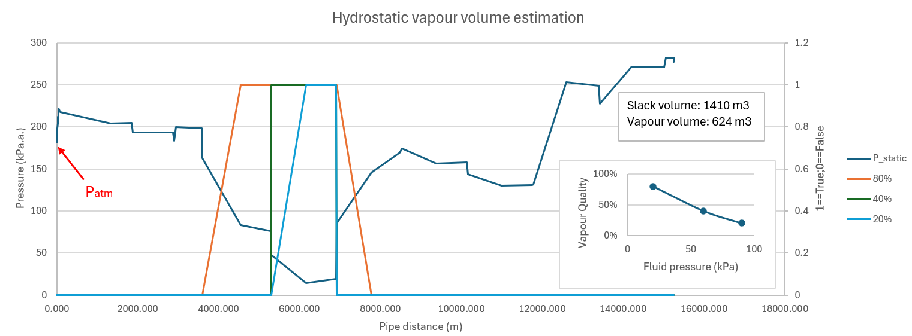
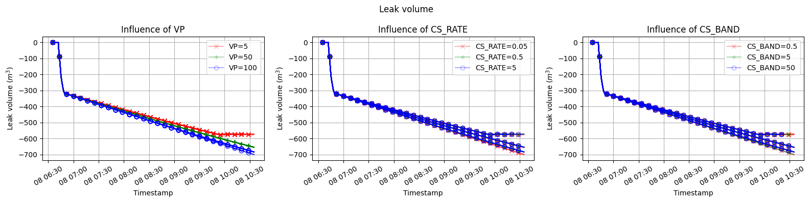
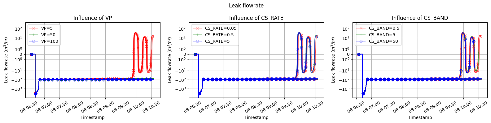
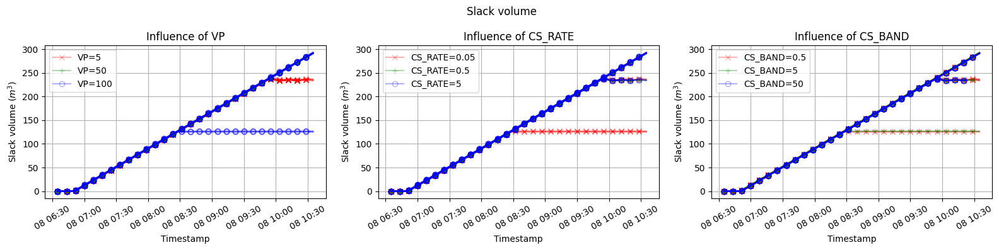
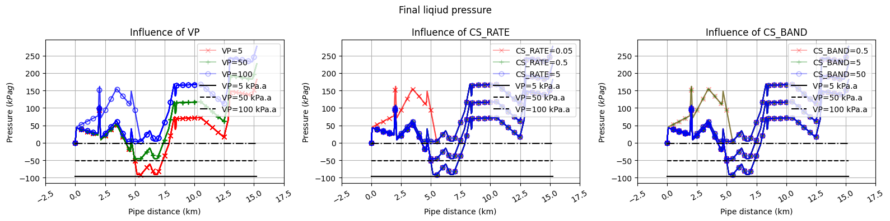
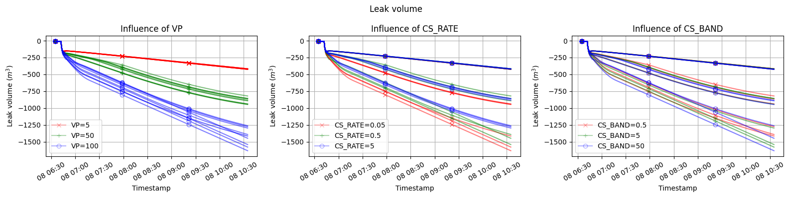
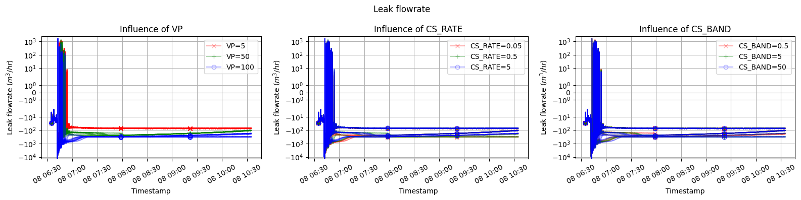
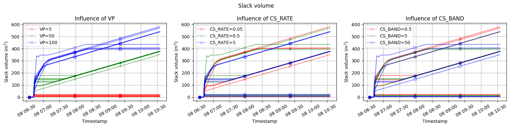
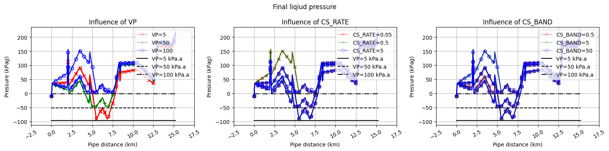

# Hydrostatic estimation

Assuming an initial liquid packed line with minimum pressure in the pipeline above $P_{atm}$, after the pipeline settles into hydrostatic state after rupture at 0 pipe distance, the hydrostatic pressure distribution, without considering effect of vaporization, is shown below.

Over laying the hydrostatic pressure with an assume vapour quality line of the enclosed product, slack volume is estimated to be 1410 $m^3$ and vapour volume is about 624 $m^3$. The leak volume should be slightly less than the vapour volume - final vapour volume less the total liquid-equivalent vapour volume to be precise.

# Valve

The rupture is simulated with a rapidly open valve ($CVO=1000$, $T=0.01min$). The goal is to identify a set of column separation parameters that will yield reasonable result compared to the above estimation. The parameters are:

- Vapour pressure: [5, 50, 100] $kPa.a$
- Column Separation Rate: [0.05, 0.5, 5] $m/kPa$
- Column Separation Band: [0.5, 5, 50] $kPa$

Note that in SPS, slack volume equals vapour volume as no vapour quality is considered.

To summarize result:

1. Converged: Vapour pressure: [5] $kPa.a$
    - Leak volume: 580 $m^3$
    - Slack (vapour) volume: 245 $m^3$
    - Leak rate converged to $\pm 10$ $m/s$ 

2. Diverged: Vapour pressure: [100] $kPa.a$ AND Column Separation Rate: [0.05] $m/kPa$ AND Column Separation Band: [0.5, 5] $kPa$
    - Leak volume: continue to grow 100 $m^3/hr$
    - Slack (vapour) volume: 125 $m^3$
    - Leak rate: continue at -100 $m^3/hr$

3. Not yet converged: Not 1 AND 2:
    - Leak volume: continue to grow 100 $m^3/hr$
    - Slack (vapour) volume: continue to grow 80 $m^3/hr$
    - Leak rate: continue at -100 $m^3/hr$

General observation:

- Leak rate always seem to outgrow slack volume growth rate - indication of breaking mass balance.
- In some cases, this violation cause diverge results - infinite breaking of mass balance - end state would be out of bound.
- Case 1 slack volume is similar to estimated vapour volume, but leak volume is off due, most likely due to violation of mass balance.
- Case 3 may result in another converged state (especially for VP=50 $kPa.a$) but it will be similar to Case 1. 

Conclusion:

In a offline scenario, SPS can be tuned to get either leak volume, slack volume or vapour volume tuned to match expectation, but not more than one of these three at the same time.

# No valve

The rupture is simulated with full SPS online model, with leak volume estimated from summation of diagnostic flow of monitors between the leak section bounded by two finally closed valves.

Same parameters are used as the no valve case.

To summarize result:

No results are truly converged but they can be some what devided into three groups:

1. Vapour pressure: [5] $kPa.a$
    - Leak volume: continue to grow 100 $m^3/hr$ (at ~300 $m^3$)
    - Slack (vapour) volume: ~10 $m^3$
    - Leak rate: continue at -100 $m^3/hr$ 

2. Vapour pressure: [50] $kPa.a$
    - Leak volume: continue to grow 100 $m^3/hr$ (at ~800 $m^3$)
    - Slack (vapour) continue to grow 100 $m^3/hr$ (at ~380 $m^3$)
    - Leak rate: continue at -100 $m^3/hr$ 

3. Not yet converged: Not 1 AND 2:
    - Leak volume: continue to grow 100 $m^3/hr$ (at >1200 $m^3$)
    - Slack (vapour) some converged at ~400 $m^3$ and some continue to grow 100 $m^3/hr$ (>500 $m^3$) - No obvious control parameters
    - Leak rate: continue at -100 $m^3/hr$ 

General observation:

- Same issue for violation of mass balance is observed.
- No cases are truly converged - this is most likely not physical and an artifact from state estimation.
- Final results of the pressure profiles are almost identical between the two cases. This could be used to refine the slack/vapour/leak volume estimate.

Conclusion:

Leak Finder with Column Separation have difficulty in converging leak/slack/vapour volume. The only converged result seem to be pressure profile, which could potentially be used to build custom leak/slack/vapour tool by adding method similar to hydrostatic estimation shown at the beginning.

