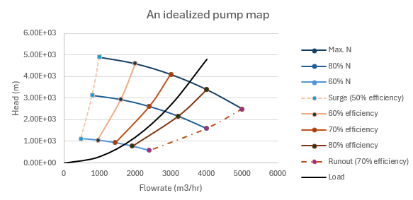
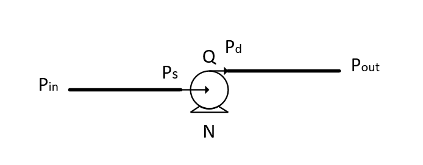
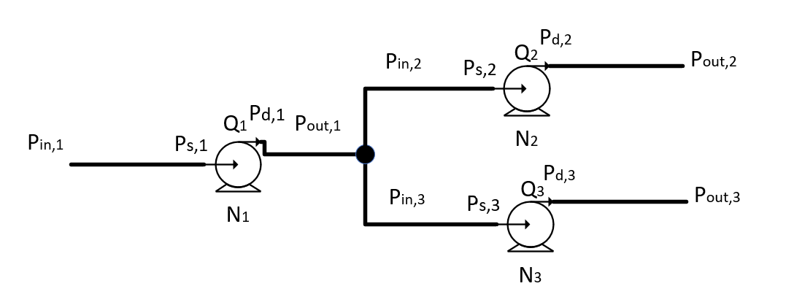

# Pipeline hydraulics (liquid)

Pipeline hydraulics is concerned with the modelling of fluid dynamics inside a pipeline system, consisting of piping and equipment along with their control systems. The engineering objective in utilizing these models is to ensure the safe and optimal operation of the pipeline system.

## Assumptions

The following assumptions are typically made:

1. One-dimensional fluid dynamics: all flow-related variables are constrained to vary only in the direction of the pipeline.
2. One-dimensional heat transfer: temperature exchange between the fluid and its environment is constrained to vary only in the radial direction of the pipeline.
3. Empirical model for frictional loss: viscous losses of the fluid are simplified to empirical data for steady-state pipe flows.
4. Empirical model for equipment: the dynamics of pumps, valves, and other flow equipment are simplified to empirical data for steady-state operations. The dynamic response of the equipment may also be considered in transient analyses.

## Solution variables

Let $x$ be the pipe direction, and $r$ be the radial direction of the pipe. The solution variables that fully describe the dynamics of a pipeline system are:

1. $\rho(x, t)$: density of the fluid [kg/m^3].
2. $Q(x, t)$: flowrate [$m^3/s$], or velocity $u(x)=Q(x)/A(x)$ [$m/s$], where $A(x)$ is the pipe cross-sectional area [$m^2$].
3. $P(x, t)$: fluid pressure [$Pa$].
4. $T(x, t)$: fluid temperature [$K$].
5. $T_{e}(x, r, t)$: temperature of the environment surrounding the fluid [$K$], varying with axial and radial position.

## Equations

### Pipes

Fluid flow inside a pipeline has been modelled as one-dimensional owing to the fact that it is long, usually when its length ($L$ [$m$]) is much larger than its diameter ($D$ [$m$]), say $L/D\gg1$. The equations to solve are typically:

- Conservation of mass: 
$$ \partial_t \rho + \partial_x (\rho u) = 0 $$
- Conservation of momentum: 
$$\partial_t (\rho u) + \partial_x (\rho u^2) = -\partial_x (P + \rho g H) - \frac{f\rho u|u|}{2D} $$
- Conservation of energy:
$$\partial_t (\rho c_v T + P + \rho u^2/2) + \partial_x [u (\rho c_v T + P + \rho u^2/2)] = -\pi D h (T - T_{e, r=0}) $$
- Equation of state: 
$$F(\rho, P, T) = 0 $$

with constants:

1. $D(x)$: pipe inner diameter [$m$],
2. $f(x)$: friction factor from empirical model [dimensionless], 
3. $H(x)$: elevation profile of the pipe [$m$],
4. $c_v(x)$: specific heat capacity at constant volume for the fluid [$J/kg·K$],

with additional unknown $h(x)$ [$W/m^2·K$], the heat transfer coefficient between the fluid and the pipe inner wall, calculated by solving the heat transfer equation:

$$\rho_{e}c_p\partial_t T_{e} + \partial_r (kT_{e}) + \dot{q} = 0$$ 

with constants:

1. $\rho_{e}(x,r)$: density of the environment [$kg/m^3$],
2. $c_p(x,r)$: specific heat capacity at constant pressure of the environment [$J/kg·K$],
3. $k(x, r)$: heat conductivity of the environment [$W/m·K$],
4. $\dot{q}(x, r)$: rate of heat source/sink of the environment [$W/m^3$],

### Pumps

A pump, while operating within its design operating envelope, is assumed to be fully characterized by the Affinity Law:

1. Flowrate: $Q/N$ = constant,
2. Head rise: $\Delta{H}/N^2$ = constant, where $\Delta{H}=\Delta{P}/\rho/g$,
3. Power: $\dot{W}/N^3$ = constant,

with a predetermined $\Delta{H}$ to $Q$ relationship at constant speed $N$ [$rpm$], termed Head Curve, and $\dot{W}$ [$W$] to $Q$ relationship at constant speed $N$, termed Power Curve (or Efficiency Curve, which is equivalent with efficiency $\eta=\Delta{P}Q/\dot{W}_{actual}$), the operating point of the pump {$Q$, $\Delta{H}$, $\dot{W}$, $N$} can be determined with given any two of the four variables.

An idealized pump characteristics as a visual representation of the above equations:

The dynamics of the pump/motor assembly may be modelled as a mass-damper system, with $\theta$ being the angle of rotation [$rad$] ($\dot{\theta}=\omega$, and $\omega=2\pi N/60$):

$$I\ddot{\theta}+c\dot{\theta}=\tau(t)$$

where $I$ is the rotational moment of inertia of the pump/motor assembly [$kg·m^2$], $c$ is the damping coefficient [$N·m·s/rad$], and $\tau(t)$ is the torque [$N·m$], which can be related to pump power $\dot{W}=\tau \omega$.

### Valves

Valves are pressure/energy loss elements in the system, and can be thought of as the equivalent of the frictional loss term in the conservation of momentum equation for pipes. Typically, valves are modelled as:

$$
Q = C_v(\alpha) \sqrt{\Delta P \rho_{water}/\rho}
$$

where:

1. $Q$: flowrate through the valve [$m^3/s$].
2. $C_v(\alpha)$: valve coefficient obtained with water as the test fluid [$m^3/s/√Pa$] (unit typically in US [$gpm/√psi$] and conversion factor is required to SI.), where $\alpha$ [$^o$] is the opening angle of the valve.
3. $\Delta P$: pressure drop across the valve [$Pa$].
4. $\rho_{water}$: density of water at standard conditions [$kg/m^3$].
5. $\rho$: actual density of the fluid flowing through the valve [$kg/m^3$].

Check valves can be modelled as a special case: 

$$
Q = 
\begin{cases} 
C_v \sqrt{\frac{(\Delta P - \Delta P_{\text{crack}}) \rho_{\text{water}}}{\rho}} & \text{if } \Delta P > \Delta P_{\text{crack}} \\
0 & \text{if } \Delta P \leq \Delta P_{\text{crack}}
\end{cases}
$$

where $\Delta P_{\text{crack}}$ [$Pa$]is the pressure differential required for the check valve to crack open.

### Constants and tunable parameters

The accuracy of these models depends on the adequacy of the model constants. Although all model constants are technically tunable, some constants can be measured more exactly than the others. To distinguish them, the constants that cannot be measured accurately and require adjustment are called tunable parameters hereafter.

 - Pipes
    -   Constants: $D(x)$; $H(x)$; $c_v(x)$;
    -   Tunable parameters: sub-parameters of $f(x)$ which include pipe roughness, fluid viscosity and density; $c_p(x,r)$, $\rho_e(x,r)$, 
 - Pumps
    -   Constants: Head Curve; Power (Efficiency) Curve; Driver Specifications
    -   Tunable parameters: $I$; $c$;
 - Valves
    -   Constants: N/A
    -   Tunable parameters: $C_v(\alpha)$, where $\alpha$ is the input.

## Solution method

A network of pipes, pumps and valves will turn the above into a set of Partial Differential Equations (pipes), Ordinary Differential Equations (pump dynamics), and algebric equations (pump and valve states). The biggest challenge in solving this problem is the solution of the pipe equations, which are a set of nonliear PDEs and commonly solved numerically. Without getting into the details of numerical methods, the steps involved in solving these equations are:

1. Replace $\rho$ with $P$ (or vise versa) using the equation of state $F$, so the solution variables becomes {$\rho$, $Q$, $T$} or {$P$, $Q$, $T$}.
2. Identify the proper boundary conditions (e.g., Dirichlet, Neumann, mixed) for $P$, $Q$, $T$ at inlet ($x = 0$) and outlet ($x = L$), typically six total.
3. Discretize the PDEs using numerical methods (e.g., Method of Characteristics or finite difference) to solve for $P$, $Q$, $T$.
4. Couple pump and valve equations with pipe PDEs, solving iteratively for nonlinear terms.

## Boundary Condition Types

### Dirichlet Boundary Conditions:

Definition: Specifies the value of the variable at the boundary.

General Form: $u(x_b, t) = f(t)$, where $u$ is the variable ($P$, $Q$, or $T$), $x_b$ is the boundary ($x = 0$ or $x = L$), and $f(t)$ is a prescribed function (possibly constant).

Examples in Pipeline Hydraulics:

Pressure ($P$): $P(0, t) = P_{\text{in}}(t)$ (e.g., reservoir pressure at inlet), $P(L, t) = P_{\text{out}}(t)$ (e.g., downstream demand pressure set by pressure control valve).
Flowrate ($Q$): $Q(0, t) = Q_{\text{in}}(t)$ (e.g., pump flowrate at inlet), $Q(L, t) = Q_{\text{out}}(t)$ (e.g., inlet flowrate set by a flow-controlled pump).
Temperature ($T$): $T(0, t) = T_{\text{in}}(t)$ (e.g., inlet fluid temperature), $T(L, t) = T_{\text{out}}(t)$ (e.g., fixed temperature of the product being injected at inlet).

Physical Context: Dirichlet BCs are common when the boundary is controlled by equipment or systems with known values, like a control valve setting pressure or a pump delivering a specific flowrate.

### Neumann Boundary Conditions:

Definition: Specifies the spatial derivative of the variable at the boundary.

General Form: $\partial_x u(x_b, t) = g(t)$, where $g(t)$ is a prescribed function (often zero for simplicity).

Examples in Pipeline Hydraulics:
- Pressure ($P$): $\partial_x P(0, t) = 0$ or $\partial_x P(L, t) = 0$ (e.g., a smooth transition to a large reservoir).
- Flowrate ($Q$): $\partial_x Q(0, t) = 0$ (a smooth flowrate gradient at the inlet driven by a pump).
- Temperature ($T$): $\partial_x T(L, t) = a$ (e.g., insulated outlet, implying no heat transfer between the outlet and the other side of the delivery end).

### Mixed (Advective, Non-Reflective, Relational, or Outflow) Boundary Conditions
Definition: Specifies a relationship involving the variable and its derivative, or a relationship between multiple variables.
Form:

Advective: $\frac{Q}{A} \frac{\partial v}{\partial x}(x_b, t) = a(t)$, where $v$ is $P$, $Q$, or $T$.
Non-Reflective: $\frac{\partial P}{\partial x}(L, t) = 0$ or $P - \frac{\rho_0 a}{A} Q = \text{constant}$ at outlet.
Relational: $v(x_b, t) = F(w(x_b, t))$ (e.g., valve, pump).
Outflow: Combines advective, non-reflective, or relational forms for fluid exit, often at $x = L$.

Examples:

Advective:
- $\frac{Q}{A} \frac{\partial T}{\partial x}(L, t) = 0$ (temperature flux).

Non-Reflective:
- $P(L, t) - \frac{\rho_0 a}{A} Q(L, t) = \text{constant}$ (pressure-flow non-reflective, characteristic-based).
- $\frac{\partial P}{\partial t} - \frac{\rho_0 a}{A} \frac{\partial Q}{\partial t} = 0$ (time-based, pressure-flow non-reflective).

Relational:
- Valve: $Q(L, t) = C_v(\alpha) \sqrt{\frac{(P(L, t) - P_{\text{downstream}}) \rho_{\text{water}}}{\rho}}$.
- Pump: $P(0, t) = \rho g \Delta H(Q(0, t), N)$.

### Use case in pipeline hydraulics
For the six required boundary conditions (three at inlet, three at outlet), you can mix and match these types based on the physical setup. Here’s how they might look for a typical liquid pipeline:

Inlet ($x = 0$) pump:
- Mixed for $P$: $P(0, t) = \rho g \Delta H(Q(0, t), N)$ (pump Head Curve).
- Neumann for $Q$: $\partial_x Q(0, t) = 0$ (smooth flow from pump).
- Dirichlet for $T$: $T = a(t)$ (temperature of the product).

Outlet ($x = L$) back pressure control valve:
- Mixed for $P$: $Q(L, t) = C_v(\alpha) \sqrt{\frac{(P(L, t) - P_{\text{downstream}}) \rho_{water}}{\rho}}$ (valve curve to set pressure based on flow and valve opening).
- Neumann for $Q$: $\partial_x Q(L, t) = 0$ (smooth flow exit).
- Mixed for $T$: $\frac{Q}{A} \frac{\partial T}{\partial x}(L, t) = 0$ (advect temperature out the pipe).

# Main characteristics of pipeline hydraulics

There are three main characteristics of the aforementioned conservation equations that are relevant to pipeline hydraulics, namey, steady-state, slow transient and rapid transient. To illustrate these charateristics, let's simplify the equations with the following:

- Weakly compressible flow, with the equation of state being a constant bulk modulus (typically isentropic): $K = \rho \frac{\partial P}{\partial \rho}$.
- Isothermal flow, negligible temperature change along the flow direction.
- Constant pipe cross-sectional area $A$.

## Steady-State 

Mathematically speaking, this is a condition where density ($\rho$) and momentum ($\rho u$) do not change with time. In practice, a useful equivalent is that the change of density and momentum in time are stochastic around a well-defined average, due to random perturbation at the boundary, typically due to controller response and variation in product properties.

With time derivative of $\rho$ and $\rho u$ being zero, and $Q = u A$, the conservation equations can be reduced to:

**Mass**:
$$
\frac{\partial}{\partial x} (\rho Q) = 0 
$$

**Momentum**:
$$
\frac{\partial}{\partial x} \left( \frac{(\rho Q)^2}{\rho_0 A^2} + \frac{P}{\rho_0} \right) = -\rho_0 g \frac{\partial H}{\partial x} - \frac{f (\rho Q) |\rho Q|}{2 \rho_0 A^3 D}
$$

**Final Form (mass)**:
$$
\rho Q = \text{constant}
$$
**Final Form (momentum)** (approximating $\rho \approx \rho_0$, integrated over length $L$):
$$
\Delta P = -\rho_0 g [H(L) - H(0)] - \frac{f (\rho Q) |\rho Q|}{2 \rho_0 A^3 D}
$$ 
where $\Delta P(t) = P(L) - P(0)$.

**Description**: Hydrostatic pressure and frictional losses dominate pressure drop; mass flow rate is constant. Frictional losses are governed by the [Darcy friction factor](https://en.wikipedia.org/wiki/Darcy_friction_factor_formulae) ($f$), which depends on pipe roughness and flow regime, and can be determined using the [Moody chart](https://en.wikipedia.org/wiki/Moody_chart), a graphical representation of $f$ versus Reynolds number and relative roughness.

## Slow transient

Slow Transient

When a pipeline system running at steady-state is perturbed at one or more boundaries by a slowly varying disturbance (e.g., valve adjustment or pump speed change), it undergoes a slow transient, transitioning from one steady-state to another, possibly returning to the original state if the disturbance is small. In this regime, the nonlinear advection term $\frac{\partial}{\partial x} \left( \frac{(\rho Q)^2}{\rho A^2} \right)$ is negligible due to small spatial gradients in $\rho Q$, and the equations simplify to:

**Mass**: 
$$
\frac{\partial \rho}{\partial t} + \frac{1}{A} \frac{\partial}{\partial x} (\rho Q) = 0
$$ 
Using $K = \rho \frac{\partial P}{\partial \rho} \approx \rho_0 \frac{\partial P}{\partial \rho}$, so $\frac{\partial \rho}{\partial t} = \frac{\rho_0}{K} \frac{\partial P}{\partial t}$: 
$$
\frac{\rho_0}{K} \frac{\partial P}{\partial t} + \frac{1}{A} \frac{\partial}{\partial x} (\rho Q) = 0
$$

**Momentum**: 
$$ 
\frac{1}{\rho_0} \frac{\partial}{\partial t} (\rho Q) + \frac{1}{\rho_0} \frac{\partial P}{\partial x} = -\rho_0 g \frac{\partial H}{\partial x} - \frac{f (\rho Q) |\rho Q|}{2 \rho_0 A^3 D} 
$$

**Final Form (Mass)** (integrated over pipe length $L$): 

$$
\rho_0 [Q(0, t) - Q(L, t)] = \frac{\rho_0 A}{K} \frac{d}{dt} \int_0^L P dx 
$$

**Final Form (Momentum)** (integrated over pipe length $L$, quasi-steady): 
$$ 
\Delta P(t) = -\frac{d}{dt} \int_0^L \rho Q dx - \rho_0 g [H(L) - H(0)] - \frac{f (\rho Q) |\rho Q| L}{2 A^3 D} 
$$ 
where $\Delta P(t) = P(L, t) - P(0, t)$.

Description: Linepack, the change in pipeline pressure due to fluid accumulation, is driven by the difference between inlet and outlet mass flow rates (mass in - mass out). The quasi-steady pressure drop $\Delta P$ includes contributions from transient mass flow changes, hydrostatic effects, and frictional losses, governing inventory management and leak detection during slow transients, such as valve throttling or pump adjustments, where pressure changes dominate over wave propagation.

## Rapid Transient

Rapid transients in pipeline systems occur when boundary conditions change abruptly, such as valve closure, pump shutdown during an emergency, or rapid decompression from a rupture. These events generate pressure waves that propagate at approximately the fluid’s speed of sound. The full original mass and momentum conservation equations are required to capture these dynamics.

**Mass** (see Slow Transient derivation): 
$$
\frac{\rho_0}{K} \frac{\partial P}{\partial t} + \frac{1}{A} \frac{\partial}{\partial x} (\rho Q) = 0 
$$

**Momentum**: 
$$ 
\frac{1}{\rho_0} \frac{\partial}{\partial t} (\rho Q) + \frac{\partial}{\partial x} \left( \frac{(\rho Q)^2}{\rho A^2} + \frac{P}{\rho_0} \right) = -\rho_0 g \frac{\partial H}{\partial x} - \frac{f (\rho Q) |\rho Q|}{2 \rho_0 A^3 D} 
$$

**Final Wave-Like Equation** (take $\partial_x$ of the momentum equation and substitute the mass equation): 
$$ 
\frac{\partial^2 P}{\partial t^2} - a^2 \frac{\partial^2 P}{\partial x^2} = a^2 \frac{\partial^2}{\partial x^2} \left( \frac{(\rho Q)^2}{\rho_0 A^2} \right) + a^2 \frac{\partial}{\partial x} \left( \rho_0 g \frac{\partial H}{\partial x} + \frac{f (\rho Q) |\rho Q|}{2 \rho_0 A^3 D} \right) 
$$ 
where $a = \sqrt{\frac{K}{\rho_0}}$ is the wave speed.

The left-hand side is the classical wave equation for pressure. The right-hand side includes nonlinear advection, which drives wave propagation, and frictional loss and elevation effects, which modify the wave’s amplitude and shape.

Description: Rapid transients produce traveling pressure waves at speed $a$, initiated by nonlinear advection and modified by friction and elevation changes. These govern water hammer and surge analysis. Slow and rapid transients can occur simultaneously, e.g., a downstream valve slamming shut creates pressure waves, while an upstream pump, still running until shutdown, induces a slow transient linepack change, affecting inventory buildup and pressure control.

## Nonlinearity and the Jacobian matrix

The characteristics described above can be understood more rigorously with a Characteristic Analysis of Partial Differential Equations.

The starting point is to put the original equations in quasi-linear form, $\partial_t \mathbf{U} + \mathbf{A} \partial_x \mathbf{U} = \mathbf{S}$, with the hope to apply an eigendecomposition of : $\mathbf{A} = \mathbf{Q}\mathbf{\Lambda}\mathbf{Q}^{-1}$, where $\mathbf{\Lambda}=\text{diag}[\lambda_1, \lambda_2, \lambda_3]$, so that the quasi-linear form can be converted to:

$$
\partial_t (\mathbf{Q}^{-1}\mathbf{U}) + \mathbf{\Lambda} \partial_x (\mathbf{Q}^{-1}\mathbf{U}) = \mathbf{Q}^{-1}\mathbf{S}
$$

Since $\mathbf{\Lambda}$ is diagonal, the original set of  equations are converted into a set of advection equations, with the diagonal elements of $\mathbf{\Lambda}$ being the advection velocity of each equation.

To apply this to the pipeline equations, let $\mathbf{U} = \begin{bmatrix} P & u & T \end{bmatrix}^T$ are the primitive variables we choose to express the equations in. Key steps can be summarized as:

- Rewrite equations: Express each conservation equation in terms of $\partial_t \mathbf{U}$ and $\partial_x \mathbf{U}$, isolating time and spatial derivatives.
- Handle non-standard terms: The energy equation contains $\partial_t u$ and $\partial_t P$, which are non-standard; assume these are adjusted or absorbed to align with $\partial_t T$, focusing on spatial derivatives for $\mathbf{A}$.
- Extract Jacobian ($\mathbf{A}$): Collect coefficients of $\partial_x P$, $\partial_x u$, $\partial_x T$ from each equation to form the rows of $\mathbf{A}$.
- Source terms ($\mathbf{S}$): Group non-derivative terms (e.g., friction, heat transfer) into the source vector $\mathbf{S}$.

The conservation equations in quasi-linear matrix form are: 
$$ 
\partial_t \begin{bmatrix} P \\ u \\ T \end{bmatrix} + \begin{bmatrix} u & K & 0 \\ \frac{1}{\rho} \left( 1 + \frac{\rho g H}{K} \right) & u & 0 \\ \frac{u \left( \rho c_v T + P + \frac{\rho u^2}{2} \right)}{c_v K} & \frac{\rho c_v T + P + \frac{\rho u^2}{2}}{\rho c_v} & u \end{bmatrix} \partial_x \begin{bmatrix} P \\ u \\ T \end{bmatrix} = \begin{bmatrix} 0 \\ -g \partial_x H - \frac{f u |u|}{2 D} \\ -\frac{\pi D h (T - T_e)}{\rho c_v} \end{bmatrix}
$$

The eigenvalues of the Jacobian ($\mathbf{A}$) are: 

$$ 
\lambda_1 = u
$$

$$
\lambda_{2,3} = u \pm \sqrt{\frac{K}{\rho} + g H}
$$ 

These represent the characteristic wave speeds: $\lambda_1 = u$ corresponds to advection of quantities like density and temperature, while $\lambda_{2,3}$ describe nonlinear pressure-velocity waves, approximating acoustic speeds modified by gravity. The PDE system is classified as strictly hyperbolic because all eigenvalues $\lambda_1$, $\lambda_2$, $\lambda_3$ are real and distinct, and this kind of systems are characterized by solutions that propagate along well-defined characteristic curves or surfaces, resembling wave-like behavior. Additionally the system is nonlinear, because the Jacobian ($\mathbf{A}$) contains also the primitive variables. However, for pipeline applications, $\lambda_1$ is typically orders of magnitude smaller than $\lambda_{2,3}$, making the nonlinear advection of momentum an negligible event compared to the pressure waves arise from compressibility.

# Examples

## Steady-State Control of a Simple Pipeline

### Problem statement

The pipeline system includes a pump with suction and discharge pressures, connected by inlet and outlet pipes. The variables of interest are:
- $P_{in}$: Inlet pressure of the pipeline on pump suction side.
- $P_{out}$: Outlet pressure of the pipeline on pump discharge side.
- $P_s$: Pump suction pressure.
- $P_d$: Pump discharge pressure.
- $Q$: Flow rate.
- $N$: Pump speed (control variable).

Show that if $P_{in}$ and $P_{out}$ are given as boundary conditions, the above system can be controlled in a steady-state sense.

### Solution

The system is described by the following equations:

Where $k_2$ is the outlet pipe loss coefficient.

1. Inlet pipe pressure loss: $P_s - P_{in} = k_1 Q^2$
2. Outlet pipe pressure loss: $P_{out} - P_d = k_2 Q^2$
3. Pump curve parametrized by speed (pump ,ap):
   - Generally:
      - Pump curve at reference speed: $f(Q_{ref}, P_d-P_s)=0$
      - Parametrization: $Q/N=C_1$ and $((P_d-P_s)/N)^2=C_2$
   - Special case - a quadratic form for the reference pump curve: $ P_d-P_s = a Q_{ref}^2 + b$:
      - Pump map: $P_d-P_s = a (Q_{ref} N/N_{ref})^2 + b$
4. Control law: find $N$ such that measurement matches setpoint. Possible controlled variables are:
   - Pump suction pressure: $P_s$
   - Pump discharge pressure: $P_d$
   - Pump (system) flowrate: $Q$

Total number of unknowns are 4, and total number of equation are also 4, so the system is determined and can be solved exactly.

## Steady-State Control of a Pipeline Network

### Problem statement

Show that steady-state control is feasible in a pipeline network, built from elements of the previous example.

### Solution

Each node that connects two or more elements of Example 1 must add the below equations:

1. Kirchhoff's Law (fluid equivalent): $\sum_i Q_i = 0$
2. All pressure at node must equal to each other: $P_{out,1}=P_{in,2}$ and $P_{in,3}=P_{in,2}$

Joining $P_{out,1}$, $P_{in,2}$ and $P_{in,3}$ creates 3 unknowns but also the above 3 equations, together with the boundary conditions $P_{in,1}$, $P_{out,2}$ and $P_{out,3}$, the system can be closed with the following equation for each branch $i$:

1. Inlet pipe pressure loss: $P_{s,i} - P_{in,i} = k_1 Q_i^2$
2. Outlet pipe pressure loss: $P_{out,i} - P_{d,i} = k_2 Q_i^2$
3. Pump curve parametrized by apeed (pump map):
   - Generally:
      - Pump curve at reference speed: $f(Q_{ref,i}, P_{d,i}-P_{s,i})=0$
      - Parametrization: $Q_i/N_i=C_{1,i}$ and $((P_{d,i}-P_{s,i})/N_i)^2=C_{2,i}$
   - Special case - a quadratic form for the reference pump curve: $ P_{d,i}-P_{s,i} = a Q_{ref,i}^2 + b_i$:
      - Pump map: $P_{d,i}-P_{s,i} = a (Q_{ref,i} N_i/N_{ref,i})^2 + b_i$
4. Control law: find $N_i$ such that measurement matches setpoint. Possible controlled variables are:
   - Pump suction pressure: $P_s$
   - Pump discharge pressure: $P_d$
   - Pump (system) flowrate: $Q$. However, due to the Kirchhoff's Law, only one pump can be controlled on flowrate.